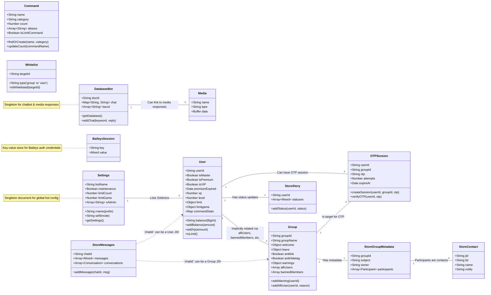

---

<h1 align="center">FN WHATSAPP BOT</h1> 

---

## Architecture & Features

**FNBOT** is a multifunctional WhatsApp bot platform built with **Baileys**. This project is designed with robust modular architecture, with primary focus on **performance, security,** and **ease** of feature addition.




---

## Project Structure

```
.
├── core/                 # Core engine & bot logic
├── database/             # Database connections & session storage
├── logs/                 # Activity and error logs
├── src/
│   ├── lib/              # Helper libraries & event handlers
│   ├── media/            # Media utility
│   ├── models/           # MongoDB schemas & models
│   ├── plugins/          # All bot commands (modular plugins)
│   ├── sampah/           # Temporary media storage
│   ├── utils/            # Utilities (logger, security, etc.)
│   └── worker/           # Async Worker for heavy process.
├── test/                 # Automated testing files
├── config.js             # Main configuration file
├── ecosystem.config.cjs  # PM2 configuration (deployment)
└── package.json          # Project dependencies
```

---

### Directory Structure

The directory structure is designed to separate each concern, making the codebase clean and maintainable.

* `core/`
    * **Heart** of the bot that handles application lifecycle and core processing logic.
    * `main.js`: **Main application entry point.** Initializes all modules and starts connection.
    * `connection.js`: Handles connection, authentication (QR/Pairing Code), and Baileys connection events.
    * `handler.js`: **Message processing brain.** Receives normalized messages and routes them to plugins or automatic features.
    * `client.js`: Collection of wrapper functions to simplify Baileys interactions (e.g., `sendMessage`, `getMediaBuffer`).

* `database/`
    * Data layer, schemas, and session management.
    * `connection/index.js`: Manages MongoDB connection with retry logic.
    * `auth.js`: Schema and logic for storing Baileys login sessions in MongoDB.
    * `StoreDB.js`: **High-performance caching layer** between bot and database for faster data reads.
    * `index.js`: Exports all database models and connections for easy imports.

* `logs/`
    * Stores **application activity logs** (`app_activity.log`) and **internal Baileys logs** (`baileys.log`) for debugging.

* `src/lib/`
    * **Core Libraries & Business Logic.** Contains main helper functions and event handlers.
    * `function.js`: Collection of global utility functions (media conversion, fuzzy search, etc.).
    * `plugins.js`: Plugin system manager, responsible for loading, reloading, and caching commands.
    * `watcherPlugins.js`: Monitors plugin directory for **hot-reloading** feature (reload plugins without restarting bot).
    * `groupParticipantsUpdate.js`: Specialized handler for group member events (join/leave/promote/demote).
    * `serializeMessage.js`: Critical module that normalizes various Baileys message formats into one consistent `m` object.

* `src/models/`
    * **Mongoose** schema and model definitions for each database collection (e.g., `User.js`, `Group.js`, `Settings.js`).

* `src/plugins/`
    * **Modular command system.** Each subfolder here is a command category, and each `.js` file is a single command.

* `src/sampah/`
    * Temporary media storage directory for files downloaded or created before being sent or processed.

* `src/utils/`
    * Smaller, more specific supporting utility modules.
    * `dayjs.js`: Custom configuration for date and time management.
    * `errorManager.js`: Custom error definitions for better error handling.
    * `security.js`: Functions to detect dangerous messages or WhatsApp "bugs".

* `src/worker/`
    * **Async Workers.** Runs heavy CPU-intensive tasks in separate threads to keep bot responsive.
    * `sticker_worker.js`: Handles image/video to sticker conversion.
    * `audio_changer_worker.js`: Processes and modifies audio files.

* `config.js`
    * Main configuration file that loads environment variables (`.env`), owner numbers, and performance parameters.

* `ecosystem.config.cjs`
    * **PM2** configuration for production deployment, managing restarts and monitoring.

---

## Core Architecture

1. **Core System** – `client.js`, `connection.js`, `handler.js`, `main.js`
2. **Database Layer** – MongoDB with caching (`StoreDB.js`)
3. **Authentication** – Session management (`auth.js`)
4. **Message Processing** – Message serialization and handling
5. **Plugin System** – Modular command structure
6. **Security** – Bug detection and protection
7. **User Management** – VIP, Premium, daily limits
8. **Group Management** – Admin tools, AFK, mute, ban
9. **Utility Functions** – Media conversion, logging, settings

---

## Key Features

### User Management

* VIP & Premium tiers with expiration dates
* Daily command limits
* Leveling system with XP
* Balance & inventory tracking
* Mute/block functionality
* Master user control

### Group Management

* Welcome/leave/promote/demote messages
* Anti-link, anti-hidetag, anti-tag story
* AFK system with reason & duration tracking
* Per-user warning system
* Group mute & member mute
* Bad word filtering

### Security

* Detects WhatsApp bugs
* Validates JIDs and senders
* Auto-block suspicious users
* Rate limiting & spam protection

### Media Processing

* Convert multiple formats to WebP stickers
* Text-to-Speech and audio format conversion
* EXIF metadata injection for stickers
* Auto-downloads incoming media

### Statistics & Monitoring

* Command usage tracking
* User activity statistics
* Group activity monitoring
* Leaderboards
* Comprehensive logging

### Flexible Configuration

* Auto-polling settings management
* Self/Normal/Maintenance modes
* Remote command & auto-correction
* Whitelist system

---

## Quick Start

### Prerequisites

* **Node.js** ≥ 18
* **npm** or **pnpm** ≥ 8
* **MongoDB** (local or Atlas)
* **Git** ≥ 2.30
* **WhatsApp** account

---

### Installation

1. **Clone the Repository**

   ```bash
   git clone https://github.com/Terror-Machine/wabot.git
   cd wabot
   ```

2. **Install Dependencies**

   ```bash
   # Using npm
   npm install

   # Or using pnpm
   pnpm install
   ```

3. **Setup Environment Variables**

   ```bash
   cp .env.example .env
   ```

   Edit `.env` and provide:

   * `MONGODB_URI` (local or Atlas)
   * `OWNER_NUMBER` (JSON array of owner number)
   * `BOT_NUMBER` (your bot's number)

4. **Verify Configuration**
   Make sure `config.js` correctly reads values from `.env`.
   
   * Set `usePairingCode` to `true` if using pairing code login

---

### First Run

1. **Start the Bot**

   ```bash
   npm start
   ```

   Or:

   ```bash
   pnpm start
   ```

2. **Pair or Scan QR Code**

   * If `usePairingCode=false`: Scan the QR code printed in the terminal.
   * If `usePairingCode=true`: Enter the pairing code displayed.

3. **Start Using the Bot**

   * Add the bot to a group or DM it.
   * Test commands like `.help`, `.ping`, etc.

---

### Deployment with PM2

For production:

```bash
npm install -g pm2
pm2 start ecosystem.config.cjs --env production
pm2 logs
```

---

Made with ❤️ and 💦 by [Terror-Machine](https://github.com/Terror-Machine)

---