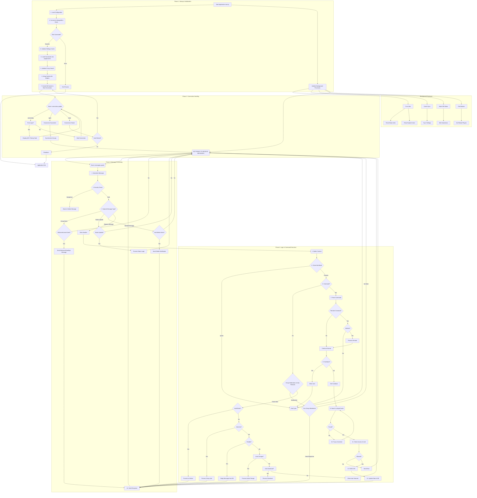
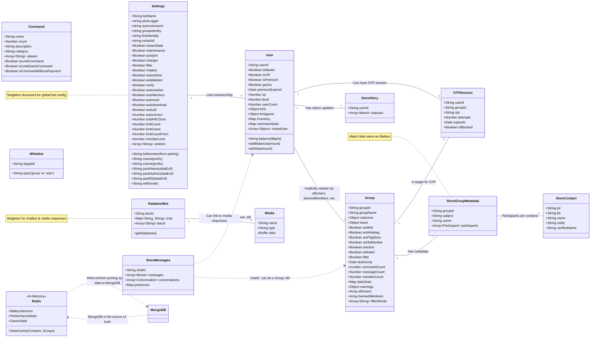

-----

<h1 align="center">FN WHATSAPP BOT</h1>

---

## About The Project

- **This is an independent project and is NOT affiliated, endorsed, or supported by WhatsApp or Meta Platforms.** It is built using the [Baileys](https://www.npmjs.com/package/baileys) library from the [WhiskeySockets/Baileys](https://github.com/WhiskeySockets/Baileys) GitHub repository with 1 server for 1 bot only. Or you can multiple with different folder project but i dont recommend for small servers.

### Core Philosophies

- **Performance**: Heavy, blocking tasks (media processing, image generation, web scraping) are offloaded to a separate pool of worker threads, ensuring the main application remains non-blocking and highly responsive. Caching is handled by an in-memory Redis database for maximum speed.
- **Stability**: The application is designed for high uptime with self-healing capabilities, including memory monitoring, connection health checks, and a graceful restart manager that prevents infinite crash loops.
- **Modularity**: A file-based plugin system allows for easy addition and hot-reloading of commands without restarting the entire application, streamlining development and maintenance.

---

## Architecture

### Workflow Diagram



### Database Schema



---

## Project Structure

The directory structure is designed for a clear separation of concerns, making the codebase clean and maintainable.

```
.
├── core/                  # Core engine & main bot logic flow
├── database/              # DB connection, session management & cache layer
├── logs/                  # Activity and error log files
├── media/                 # Media files (images, videos, etc.)
├── src/
│   ├── addon/             # Collection of native adddons built with C/C++ (e.g., ffmpeg processing)
│   ├── fonts/             # Font files assets
│   ├── function/          # Collection of feature-specific utility functions
│   ├── games/             # Game database & assets
│   ├── handler/           # Handlers for non-command features (e.g., auto-sticker)
│   ├── image/             # Image assets
│   ├── ktp/               # KTP assets & templates
│   ├── lib/               # Core libraries & business logic (plugin loader, performance)
│   ├── media/             # Media assets
│   ├── models/            # MongoDB (Mongoose) schemas & models
│   ├── plugins/           # All bot commands (highly modular)
│   ├── sampah/            # Managed temporary file storage
│   ├── utils/             # General utilities (security, scrapers, external scripts)
│   └── worker/            # Async worker system for heavy tasks (FFMPEG, Canvas)
├── .env.example           # Environment variable template
├── .gitignore             # Git ignore file
├── binding.gyp            # Build configuration for native addons
├── config.js              # Main configuration file
├── ecosystem.config.cjs   # PM2 configuration for deployment
├── eslint.config.js       # ESLint configuration
├── igdocs.js              # Instagram scraping configuration
├── install.sh             # Automated server setup script
├── jest.config.js         # Jest testing configuration
├── LICENSE                # Project license (MIT)
├── package.json           # Project metadata and scripts
├── pull.sh                # Git pull & update script
├── README.md              # Project documentation (this file)
├── system.sh              # System dependency check script
└── update.sh              # Python dependency update script
```

---

## Requirements

### Software

- **Node.js**: `v20.x` or higher
- **MongoDB**: `v4.0` or higher (local or Atlas)
- **Redis**: `v6.x` or higher
- **Git**
- **FFMPEG**: **Required** for all media processing (stickers, audio filters).
- **Python**: `v3.12` recommended.
  - **Python Libraries**: `rembg`, `yt-dlp`, `google-generativeai`, and other dependencies listed in `install.sh`.
- A valid **WhatsApp** account.

### Hardware (VPS/Server)

The resource requirements are higher than a standard bot due to heavy processing features.

- **Recommended (Production)**:
  - **CPU**: **4 vCores** or more
  - **RAM**: **8 GB** or more
  - **Storage**: **80 GB+ SSD/NVMe**
  - **OS**: Ubuntu 24.04 LTS or a similar Linux distribution. (i never try on ubuntu 22, but i recommend to use ubuntu 24)

- **Minimal (Testing/Low-Load)**:
  - **CPU**: 2 vCores
  - **RAM**: 4 GB
  - **Storage**: 50 GB SSD/NVMe

> **Note**: Running features like Instagram scraping (`Playwright`) and parallel media processing (`FFMPEG`, `Canvas`) is very resource-intensive. Using specs below the recommended values may lead to slow response times and instability.

---

## Quick Start

### Installation

The easiest way to set up is by using the `install.sh` script on a fresh Ubuntu server. This will install Node.js, MongoDB, Redis, Python, and all project dependencies.

1.  **Clone the Repository**

```bash
git clone https://github.com/Terror-Machine/fnbots.git
cd fnbots
```

2.  **Setup Environment Variables**

```bash
cp .env.example .env
```

Open and edit the `.env` file, filling in all required values:

    * `MONGODB_URI`: Your MongoDB connection string.
    * `OWNER_NUMBER`: JSON array of owner numbers.
    * `GEMINI_API_KEY`: For generative AI features. (Optional)
    * `HUGGINGFACE_API_KEY`: For generative AI features. (Optional)

3.  **Run the Automatic Setup Script**
    Execute the `install.sh` script to automatically install all system dependencies.

```bash
sudo bash install.sh
```

If you encounter errors related to `mongo`:

```bash
sudo bash mongo.sh
```

### Running the Bot

1.  **Start with Pairing Code (Recommended)**
    Use the `pair` script to log in with a pairing code. The bot will prompt you for your bot's phone number.

```bash
npm run pair
```

2.  **Start with QR Code**
    If you prefer to use a QR code, ensure `usePairingCode` is `false` in `config.js` and run:

```bash
npm start
```

Scan the QR code that appears in your terminal.

---

### Production Deployment

For production environments, using PM2 is highly recommended for process management and auto-restarts. The `install.sh` script already installs it globally.

```bash
# Start the application with PM2
pm2 start ecosystem.config.cjs

# Monitor logs
pm2 logs
```

Note: pm2 only work for foreground process, so if you want to run with pairing code, use npm run pair or set usePairingCode to true in config.js and then use npm start

For ROOT users (running at systemd level), use the `system.sh` script to set up the systemd service.

```bash
sudo ./system.sh
bot start
bot restart
bot stop
```

---

Made with ❤️ and 💦 by [Terror-Machine](https://github.com/Terror-Machine)

---
