---

<h1 align="center">FN WHATSAPP BOT</h1> 

---

## Project Architecture Diagram

```mermaid
graph TD
    subgraph "Phase 1: Startup & Initialization (`main.js`)"
        A[Mulai Aplikasi `main.js`] --> B(1. Muat Konfigurasi `.env` & `config.js`);
        B --> C(2. Hubungkan ke Database MongoDB);
        C --> D{DB Connected?};
        D -- Success --> E(3. Inisialisasi Settings Cache);
        D -- Error --> ERR1[Exit Process];
        E --> F(4. Muat Semua Perintah ke `pluginCache`);
        F --> G(5. Inisialisasi Fuzzy Search `Fuse.js`);
        G --> H(6. Bungkus Socket dgn Helpers `clientBot`);
        H --> I(7. Buat WA Socket & Mulai Koneksi);
        A --> BG(Inisialisasi Proses Latar Belakang);
    end

    subgraph "Phase 2: Connection Handling (`connection.js`)"
        I --> J{Event: `connection.update`};
        J -- `connecting` --> K[Tampilkan QR / Pairing Code];
        J -- `close` --> L[Koneksi Terputus];
        L --> M{Auto Restart?};
        M -- Yes --> I;
        M -- No --> ERR2[Shutdown];
        J -- `open` --> N[Koneksi Berhasil];
        N --> O[Sinkronisasi Grup & Bersihkan Data Usang];
        O --> P(BOT SIAP MENERIMA PESAN);
    end

    subgraph "Phase 3: Message Processing (`updateMessageUpsert.js`)"
        P --> Q(Event: `messages.upsert`);
        Q --> R[1. Normalisasi Pesan - `serializeMessage`];
        R --> S{2. Cek Keamanan `isBug`};
        S -- Berbahaya --> T[Blokir & Hapus Pesan];
        S -- Aman --> U{3. Tipe Pesan Khusus?};
        U -- Group Event --> V[`handleGroupStubMessages`];
        U -- Status Update --> W[Proses Logika Status];
        U -- Pesan Dihapus --> X[Anti-Delete Handler];
        U -- Pesan Biasa --> Y[→ Handler Utama `arfine`];
    end

    subgraph "Phase 4: Logic & Command Execution (`handler.js`)"
        Y --> Z(4. Kumpulkan Konteks);
        Z --> AA{5. Cek Mode Bot};
        AA -- Ignore --> TERM((End Cycle));
        AA -- Process --> AB{6. Command?};
        
        AB -- No --> AC_ROUTER{Moderasi Grup & Cek Fitur Auto};
            AC_ROUTER -- anti-hidetag/antilink etc. --> AC_MOD[Jalankan Moderasi Grup];
            AC_ROUTER -- Check Next --> AC1{AutoSticker?};
            AC1 -- Yes --> AC2[Proses Gambar/Video Jadi Stiker];
            AC1 -- No --> AC3{AutoJoin?};
            AC3 -- Yes --> AC4[Proses Link & Join Grup];
            AC3 -- No --> AC5{Chatbot?};
            AC5 -- Yes --> AC6[Balas Pesan dari DB];
            AC5 -- No --> AC7[...Fitur Auto Lainnya...];
        
        AB -- Yes --> AD(7. Parse Command);
        
        AD --> AE{Remote Command?};
        AE -- No --> AF[Lanjut Normal];
        AE -- Yes --> AG{SAdmin?};
        AG -- No --> TERM;
        AG -- Yes --> AH[Process Remote];
        AH --> AF;
        
        AF --> AI{8. Cooldown?};
        AI -- Yes --> AJ[Warn User];
        AJ --> TERM;
        AI -- No --> AK[Set Cooldown];
        
        AK --> AL(9. Cari di `pluginCache`);
        AL --> AM{Found?};
        AM -- No --> AN[10. Fuzzy Correction];
        AN --> AL;
        AM -- Yes --> AO[11. Cek Akses & Limit];
        AO --> AP{Allowed?};
        AP -- No --> AQ[Send Error];
        AP -- Yes --> AR[12. EXECUTE];
        
        AR --> AS[13. Update Stats & DB];
        AS --> AT[14. Send Response];
    end

    subgraph "Background Processes"
        BG --> BA[Cron Jobs];
        BG --> BB[Cache Sync];
        BG --> BC[Batch DB Writes];
        BG --> BD[File Watcher];
        
        BA --> BA1[Reset Daily Limits];
        BA --> BA2[Clean Expired Users];
        BB --> BB1[Sync Settings];
        BC --> BC1[Bulk Operations];
        BD --> BD1[Hot-Reload Plugins];
    end

    T --> P;
    V --> P;
    W --> P;
    X --> P;
    AC_MOD --> P; AC2 --> P; AC4 --> P; AC6 --> P; AC7 --> P;
    AT --> P;
    AQ --> P;
    TERM --> P;
    
    ERR1 --> EXIT[Application Exit];
    ERR2 --> EXIT;
```




---

## Project Structure

```
.
├── core/                 # Core engine & bot logic
├── database/             # Database connections & session storage
├── logs/                 # Activity and error logs
├── src/
│   ├── lib/              # Helper libraries & event handlers
│   ├── models/           # MongoDB schemas & models
│   ├── plugins/          # All bot commands (modular plugins)
│   ├── sampah/           # Temporary media storage
│   └── utils/            # Utilities (logger, security, etc.)
├── test/                 # Automated testing files
├── config.js             # Main configuration file
├── ecosystem.config.cjs  # PM2 configuration (deployment)
└── package.json          # Project dependencies
```

---

### Directory Descriptions

* **`core/`**
  The **heart** of the bot. Handles application lifecycle:

  * `connection.js`: WhatsApp connection handling
  * `handler.js`: Message processing logic
  * `client.js`: Custom client functions

* **`database/`**
  Database layer and session storage:

  * `index.js`: MongoDB connection
  * `auth.js`: Stores login sessions
  * `StoreDB.js`: High-performance caching

* **`logs/`**
  Stores **activity logs** (`app_activity.log`) and **Baileys logs** (`baileys.log`) for debugging.

* **`src/lib/`**
  Helper libraries and event handlers (`function.js`, `plugins.js`, `groupParticipantsUpdate.js`).

* **`src/models/`**
  MongoDB schemas and models (e.g., `User.js`, `Group.js`).

* **`src/plugins/`**
  Modular command system. Each folder = command category.

* **`src/sampah/`**
  Temporary media storage for downloaded files before processing.

* **`src/utils/`**
  Utilities like `logger.js`, `security.js`, and `dayjs.js`.

* **`test/`**
  Automated test files to validate features after changes.

* **`config.js`**
  Loads environment variables, owner numbers, bot number, and categories.

* **`ecosystem.config.cjs`**
  PM2 configuration for production deployment.

---

## Core Architecture

1. **Core System** – `client.js`, `connection.js`, `handler.js`, `main.js`
2. **Database Layer** – MongoDB with caching (`StoreDB.js`)
3. **Authentication** – Session management (`auth.js`)
4. **Message Processing** – Message serialization and handling
5. **Plugin System** – Modular command structure
6. **Security** – Bug detection and protection
7. **User Management** – VIP, Premium, daily limits
8. **Group Management** – Admin tools, AFK, mute, ban
9. **Utility Functions** – Media conversion, logging, settings

---

## Key Features

### User Management

* VIP & Premium tiers with expiration dates
* Daily command limits
* Leveling system with XP
* Balance & inventory tracking
* Mute/block functionality
* Master user control

### Group Management

* Welcome/leave/promote/demote messages
* Anti-link, anti-hidetag, anti-tag story
* AFK system with reason & duration tracking
* Per-user warning system
* Group mute & member mute
* Bad word filtering

### Security

* Detects WhatsApp bugs
* Validates JIDs and senders
* Auto-block suspicious users
* Rate limiting & spam protection

### Media Processing

* Convert multiple formats to WebP stickers
* Text-to-Speech and audio format conversion
* EXIF metadata injection for stickers
* Auto-downloads incoming media

### Statistics & Monitoring

* Command usage tracking
* User activity statistics
* Group activity monitoring
* Leaderboards
* Comprehensive logging

### Flexible Configuration

* Auto-polling settings management
* Self/Normal/Maintenance modes
* Remote command & auto-correction
* Whitelist system

---

## Quick Start

### Prerequisites

* **Node.js** ≥ 18
* **npm** or **pnpm** ≥ 8
* **MongoDB** (local or Atlas)
* **Git** ≥ 2.30
* **WhatsApp** account

---

### Installation

1. **Clone the Repository**

   ```bash
   git clone https://github.com/Terror-Machine/wabot.git
   cd wabot
   ```

2. **Install Dependencies**

   ```bash
   # Using npm
   npm install

   # Or using pnpm
   pnpm install
   ```

3. **Setup Environment Variables**

   ```bash
   cp .env.example .env
   ```

   Edit `.env` and provide:

   * `MONGODB_URI` (local or Atlas)
   * `OWNER_NUMBER` (JSON array of owner number)
   * `BOT_NUMBER` (your bot's number)

4. **Verify Configuration**
   Make sure `config.js` correctly reads values from `.env`.
   
   * Set `usePairingCode` to `true` if using pairing code login

---

### First Run

1. **Start the Bot**

   ```bash
   npm start
   ```

   Or:

   ```bash
   pnpm start
   ```

2. **Pair or Scan QR Code**

   * If `usePairingCode=false`: Scan the QR code printed in the terminal.
   * If `usePairingCode=true`: Enter the pairing code displayed.

3. **Start Using the Bot**

   * Add the bot to a group or DM it.
   * Test commands like `.help`, `.ping`, etc.

---

### Deployment with PM2

For production:

```bash
npm install -g pm2
pm2 start ecosystem.config.cjs --env production
pm2 logs
```

---

Made with ❤️ and 💦 by [Terror-Machine](https://github.com/Terror-Machine)

---